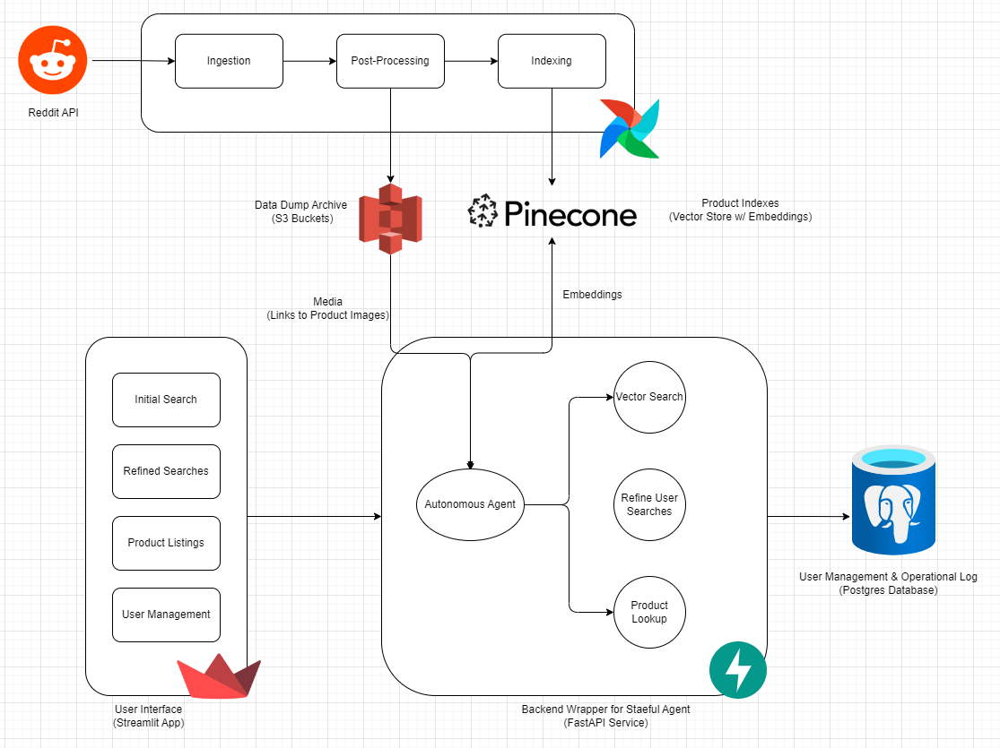

# RedCart - AI-Powered Shopping Assistant

## Objective
Shopping Agent aims to revolutionize the online shopping experience by leveraging the collective wisdom of Reddit communities to provide authentic, crowd-sourced product recommendations.

## Features
- Authentic product recommendations from Reddit communities
- Semantic matching of user queries with community discussions
- Integration with major e-commerce platforms (Amazon, Walmart, eBay)
- Real-time product information and pricing
- User-friendly web interface for product search

## Technologies and Tools
- **Backend**: 
  - Python
  - FastAPI
  - Apache Airflow
- **Frontend**: 
  - Streamlit
- **Database**: 
  - PostgreSQL
  - Pinecone (Vector Embeddings)
- **Deployment**: 
  - Docker
  - AWS

## Architecture Diagram:
  
  
  
## Project Methodology
### Data Extraction
- Scrape relevant subreddits using Reddit API
- Extract posts, comments, and user experiences
- Semantic matching of user queries with community discussions

### Recommendation Engine
- Vector embedding of Reddit posts
- Natural language search across community discussions
- LLM-powered filtering for positive experiences
- Real-time product listing fetching from e-commerce APIs

## Setup and Installation

1. Clone the repository:
   ```bash
   git clone https://github.com/koolgax99/redcart-ai-shopping-assistant.git
   ```

2. Install dependencies:
   ```bash
   # Add specific installation instructions
   poetry install --dev
   ```

3. Set up environment variables:
   ```bash
   cp .env.example .env
   # Configure your API keys and credentials
   ```

4. Run the application:
   ```bash
   # Add specific run instructions
   docker-compose up
   ```

5. Access the Airflow UI at `http://localhost:8080` to monitor and manage the pipeline.

6. Run the frontend application:
   ```
   streamlit run frontend/app.py
   ```

## Expected Outcomes
- 85%+ recommendation accuracy
- 40% reduction in product search time
- Authentic, trustworthy product recommendations
- Streamlined online shopping experience

## End User Validation
- 90% relevance in search results
- Real-time price matching with e-commerce platforms
- Accurate product category filtering

## Risks and Mitigation
- Implemented error handling for API limitations
- Comprehensive data validation processes
- Scalable cloud-based architecture
- Modular e-commerce platform integration
